# SuperBizAgent

Enterprise AI chat and operations assistant with RAG knowledge retrieval and AIOps diagnosis.

## ✨ Features

- 🤖 **Intelligent Chat** - LangChain multi-turn conversations with streaming responses or non-streaming responses
- 📚 **RAG Q&A** - RAG question answering with document upload and automatic vector indexing
- 🔧 **AIOps Diagnosis** - Automated incident diagnosis and root-cause analysis with a Plan-Execute-Replan workflow
- 🌐 **Web Interface** - Modern UI supporting multiple conversation modes: quick Q&A and streaming chat
- 🔌 **MCP Integration** - Integrated tools for log queries and monitoring data

## 🛠️ Tech Stack

- **Framework**: FastAPI, LangChain, LangGraph
- **LLM**: GPT-5.4-nano or other OpenAI-compatible chat models
- **Vector Database**: Milvus vector database
- **Tool Protocol**: MCP (Model Context Protocol)

## Project Structure
<details>
<summary><h3>Folder Tree</h3></summary>

```text
agent/
├── app/                         # FastAPI backend source code
│   ├── main.py                  # Application entry point and router registration
│   ├── config.py                # Runtime configuration loaded from environment variables
│   ├── api/                     # HTTP API route handlers
│   │   ├── chat.py              # Chat and streaming chat endpoints
│   │   ├── aiops.py             # AIOps diagnosis endpoint
│   │   ├── file.py              # File upload and indexing endpoints
│   │   └── health.py            # Health and liveness endpoints
│   │
│   ├── agent/                   # Agent orchestration code
│   │   ├── aiops/               # Plan-Execute-Replan AIOps agent workflow
│   │   └── mcp_client.py        # MCP client integration for agent tools
│   │
│   ├── core/                    # Shared infrastructure clients and helpers
│   │   ├── llm_factory.py       # LLM provider selection
│   │   ├── milvus_client.py     # Milvus connection helper
│   │   ├── prometheus_client.py # Prometheus query client
│   │   ├── prometheus_alerts.py # Alert query helpers
│   │   └── metrics.py           # Application metrics
│   │
│   ├── services/                # Business service layer
│   │   ├── __init__.py          # Service package marker
│   │   ├── aiops_service.py     # Runs the AIOps graph and stores final reports
│   │   ├── document_splitter_service.py # Splits uploaded documents into chunks
│   │   ├── rag_agent_service.py # RAG chat service
│   │   ├── vector_embedding_service.py # Builds embeddings for chunks and queries
│   │   ├── vector_index_service.py # Saves, chunks, embeds, and indexes documents/reports
│   │   ├── vector_search_service.py # Searches the vector knowledge base                       
│   │   └── vector_store_manager.py  # Milvus vector store operations
│   │
│   ├── tools/                   # Agent-callable tools
│   ├── models/                  # Request/response Pydantic models
│   └── utils/                   # Logging and utility helpers
│
├── mcp_servers/                 # Standalone MCP server implementations
│   ├── cls_server.py            # Log-search MCP server; demo mode locally, CloudWatch in AWS
│   └── monitor_server.py        # Monitoring MCP server backed by Prometheus
│
├── static/                      # Plain HTML/CSS/JS frontend served by FastAPI and Vercel
├── assets/                      # README architecture and workflow diagrams
├── aiops-docs/                  # Seed knowledge-base documents for AIOps examples
├── demo-data/                   # Local demo fixtures, including CLS log samples
├── prometheus-demo/             # Local Prometheus config and sample alerts
├── Dockerfile                   # Backend image used by local Docker and AWS
├── docker-compose.local.yml     # Local backend, MCP, and Prometheus services
├── vector-database.yml          # Local Milvus, MinIO, Etcd, and Attu services
├── Makefile                     # Local Docker convenience commands
├── pyproject.toml               # Python package metadata and dependencies
├── uv.lock                      # Locked Python dependency versions
├── .env.example                 # Generic environment template
├── .env.local.example           # Local Docker environment template
└── .env.cloud.example           # Cloud runtime environment template
```

Runtime files such as real `.env` files, logs, uploads, local vector volumes,
Vercel metadata, and private keys are intentionally ignored by Git.

</details>

## Functional Architecture


## 📡API

| Feature | Method | Path | Description |
|---------|--------|------|----------------------|
| Chat | POST | `/api/chat` | Non-streaming chat |
| Streaming chat | POST | `/api/chat_stream` | SSE chat stream |
| AIOps diagnosis | POST | `/api/aiops` | Streaming diagnosis |
| File upload | POST | `/api/upload` | Upload and index documents |
| Health check | GET | `/health` | Service health |

## Agents Workflow
<details>
<summary><h3>Knowledge Base Agent (RAG Pattern: Retrieval-Augmented Generation)</h3></summary>


The workflow is split into two lanes matching the original:
1. Indexing lane (top): Upload file -> File chunking -> Index/embed -> Store in Vector Database
2. Retrieval lane (bottom): Ask question -> Embed query -> Search Vector Database -> Augment the LLM with retrieved documents and the user question -> Generate the final answer

</details>

<details>
<summary><h3>Conversation Agent (ReAct Pattern: Reasoning + Acting)</h3></summary>


The core goal of the Conversational Agent is to combine external knowledge (RAG retrieval) with tool-calling capabilities (ReAct pattern) to solve complex problem.

The overall flow can be summarized as:
1.1 User sends an input message → Prompt construction
1.2 User message is also recalled from the Vector Database → fed back into Prompt construction
2. Prompt enters the ReAct pattern → Large model
The Tool call? diamond decides the branch:
    3.1 Yes → calls a tool from the tool set → tool response loops back (step 4) to the large model 
    3.2 No → replies directly to the user as the final answer
The loop continues until no more tool calls are needed
</details>

<details>
<summary><h3>Operations Agent (Plan-Execute-Replan Pattern)</h3></summary>


The core goal of the Operations Agent is to transform the alert-handling experience of operations engineers into an automated workflow. Through a closed loop of Plan Generation → Tool Execution → Dynamic Adjustment, it replaces manual effort in repetitive alert investigation tasks.

The overall architecture can be summarized as:
1. Retrieve alert-related context from a vector database
2. Construct a system prompt with context (recalled content and tool information)
3. Run multi-turn interactions using the Plan-Execute-Replan pattern
    a. Planner generates a structured investigation plan
    b. Executor calls monitoring/log tools to execute each step
    c. Replanner evaluates the results and decides whether to continue execution, revise the plan, or output a conclusion
4. Produce the final answer
</details>


## Project Launch 
<details>
<summary><h3>Live Demo deployed on AWS</h3>
</summary>

- Frontend: [Live frontend](https://static-rho-six.vercel.app)
- Backend health: [Backend health check](http://oncall-agent-alb-859528003.ap-southeast-2.elb.amazonaws.com/live)
The Vercel frontend rewrites `/api/*` requests to the AWS backend.

### Common Commands

```bash
make local-up          # Start full local Docker stack
make local-down        # Stop full local Docker stack
make local-logs        # View local Docker logs
make local-status      # Check local Docker services
```

### AIOps Flow

1. Planner creates a diagnosis plan.
2. Executor calls local and MCP tools.
3. Replanner decides whether to continue, adjust the plan, or respond.
4. The final report is generated as Markdown and stored in the knowledge base.

### Troubleshooting

Check logs:

```bash
tail -f server.log
tail -f mcp_cls.log
tail -f mcp_monitor.log
```

Check ports:

```bash
lsof -i :9900
lsof -i :8003
lsof -i :8004
```

Restart Milvus:

```bash
docker compose -f vector-database.yml restart
```

### Cloud Architecture

```text
Vercel static frontend
  -> /api/* rewrite
      -> AWS ALB
          -> ECS backend service
              -> one Fargate task
                  -> backend container          :9900
                  -> CLS MCP container          :8003
                  -> Monitor MCP container      :8004
                  -> AWS ADOT collector sidecar
              -> EC2 Milvus
              -> AWS Managed Prometheus
              -> CloudWatch Logs
```

The cloud stack is the live demo path. In this profile, `cls-mcp` runs in
`CLS_MODE=cloudwatch` and reads real CloudWatch Logs through AWS IAM. The
backend calls MCP through localhost inside the same ECS task:


- MCP_CLS_URL: [MCP_CLS_URL](http://127.0.0.1:8003/mcp)
- MCP_MONITOR_URL: [MCP_MONITOR_URL](http://127.0.0.1:8004/mcp)

</details>


<details>
<summary><h3>Quick Start Locally</h3>
</summary>

### Requirements

- Docker or Docker Desktop
- OpenAI API key or DashScope API key

### Local Docker Stack
This launch method is intended to be repeatable locally without access to the AWS account. The local profile runs the backend, MCP servers, Milvus, Attu, demo CLS logs, and a demo Prometheus server through Docker Compose.

### First Run

Launch Docker first.

```bash
cd agent
cp .env.local.example .env.local
```

Edit `.env.local` and set at least one LLM key:

```env
OPENAI_API_KEY=...
or
DASHSCOPE_API_KEY=...
```

Then start the full stack:
```bash
make local-up
```

This runs:

```text
backend      FastAPI app and static web UI
cls-mcp      CLS MCP server using local demo logs
monitor-mcp  Prometheus/monitoring MCP server
standalone   Milvus vector database
prometheus   Demo Prometheus server with a firing alert
attu         Milvus web UI
minio/etcd   Milvus dependencies
```

Then open:
-Frontend: [Live Frontend](http://localhost:9900)

### URLs


Web UI/API: [Web UI/PAI](http://localhost:9900)
API docs:   [API docs](http://localhost:9900/docs)
Prometheus: [Prometheus](http://localhost:9090)
Attu:       [Attu](http://localhost:8000)
MinIO:      [MinIO](http://localhost:9001)


Stop the stack with:

```bash
make local-down
```

### Local Runtime Architecture

```text
Browser
  -> localhost:9900
      -> FastAPI backend
          -> cls-mcp:8003
          -> monitor-mcp:8004
          -> standalone(Milvus vector database):19530
          -> prometheus:9090
```

Local Docker services are defined by:

```text
vector-database.yml
docker-compose.local.yml
```

### Notes

The local Prometheus alert is intentionally always firing. It lets the AIOps
diagnosis flow demonstrate real alert retrieval without requiring AWS Managed
Prometheus.

The local CLS MCP service runs with `CLS_MODE=demo`, so log search tools read
from `demo-data/cls_logs.json` instead of CloudWatch Logs. The demo timestamps
are made relative to the current time at query time, so recent-window searches
continue to return useful sample incidents.
</details>